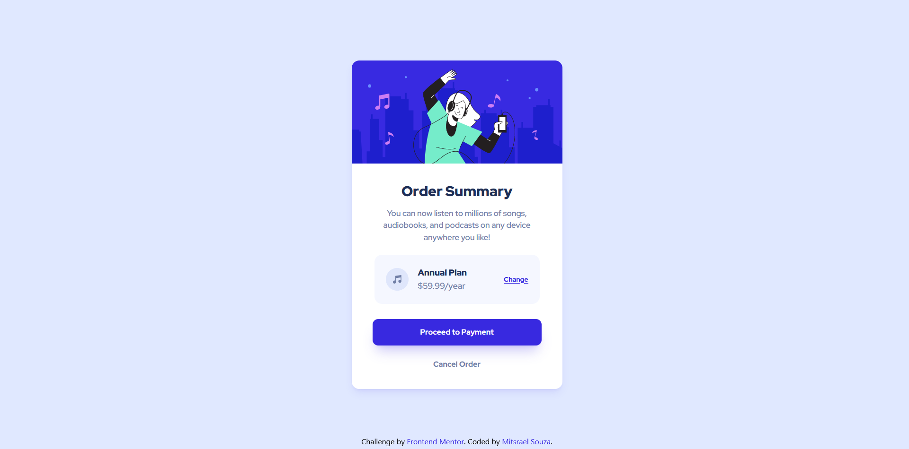
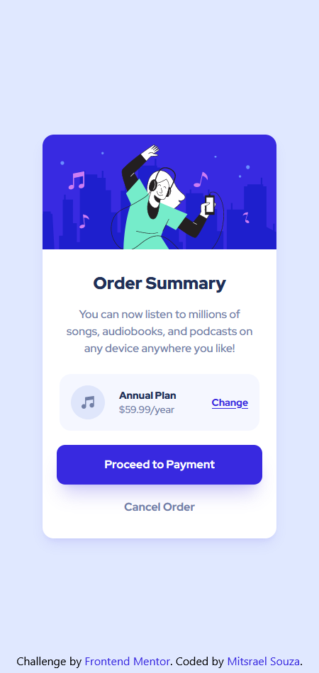

# Frontend Mentor - Order summary card solution

This is a solution to the [Order summary card challenge on Frontend Mentor](https://www.frontendmentor.io/challenges/order-summary-component-QlPmajDUj). Frontend Mentor challenges help you improve your coding skills by building realistic projects.

## Table of contents

-   [Overview](#overview)
    -   [The challenge](#the-challenge)
    -   [Screenshot](#screenshot)
    -   [Links](#links)
-   [My process](#my-process)
    -   [Built with](#built-with)
    -   [What I learned](#what-i-learned)
    -   [Continued development](#continued-development)
    -   [Useful resources](#useful-resources)
-   [Author](#author)

## Overview

### The challenge

Users should be able to:

-   See hover states for interactive elements

### Screenshot

<div align="center">
    
  
  <br /><br /><br />


<br /><br /><br />

</div>

### Links

-   Solution URL: [GitHub source code](https://github.com/M-its/order-summary-component)
-   Live Site URL: [Product preview card component page](https://m-its.github.io/order-summary-component/)

## My process

### Built with

-   Semantic HTML5 markup
-   CSS custom properties
-   Flexbox
-   [Tailwind](https://tailwindcss.com/) - Tailwind
-   Mobile-first workflow

### What I learned

In this project I tried for the first time to use the Tailwind framework.

Tailwind is a customizable framework and to use it on this project i had to make some customizations on it see how bellow:

```css
theme: {
        extend: {
            fontFamily: {
                redhd: ["Red Hat Display", "sans-serif"],
            },
            colors: {
                // Primary
                "pale-blue": "hsl(var(--pale-blue))",
                "bright-blue": "hsl(var(--bright-blue))",

                // Neutral
                "very-pale-blue": "hsl(var(--very-pale-blue))",
                "desaturated-blue": "hsl(var(--desaturated-blue))",
                "dark-blue": "hsl(var(--dark-blue))",
            },
        },
    },
```

### Continued development

I need to improve my semantic HTML an the uso of frameworks like Tailwind

### Useful resources

-   [Tailwind - documentation](https://tailwindcss.com/docs/installation) - This documentation was my guide during all the project.
-   [Alura - Tailwind: Adicionando fontes customizadas](https://www.alura.com.br/artigos/tailwind-adicionando-fontes-customizadas#:~:text=Neste%20artigo%20vimos%20como%20adicionar%20fontes%20customizadas%20em,necess%C3%A1rias%20e%20impactos%20na%20configura%C3%A7%C3%A3o%20padr%C3%A3o%20do%20framework.) - This article helped me to add custon fonts on Tailwind.
-   [StackOverflow - Change brightness of JUST the background with CSS](https://stackoverflow.com/questions/19773309/change-brightness-of-just-the-background-with-css) - This post have some examples of how to use a filter to change only the background of a div.

## Author

-   GitHub - [@M-its](https://github.com/M-its)
-   Frontend Mentor - [@M-its](https://www.frontendmentor.io/profile/M-its)
-   Codepen - [@M-its](https://codepen.io/m-its)
